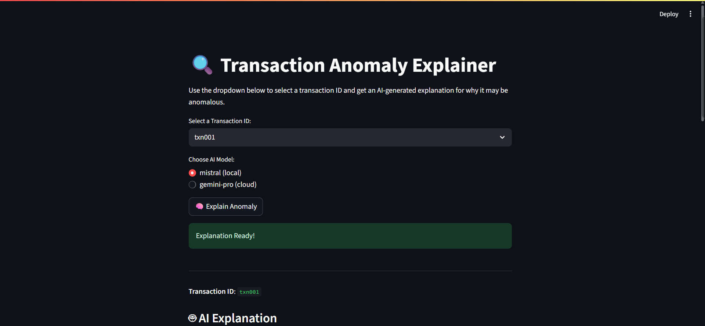
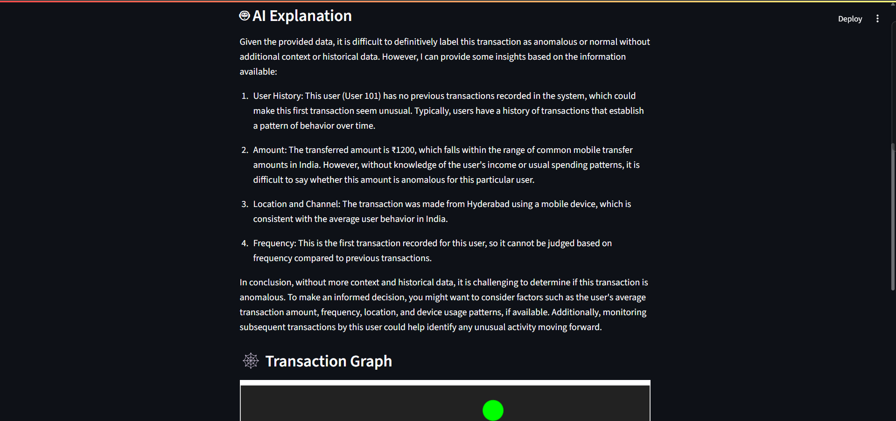
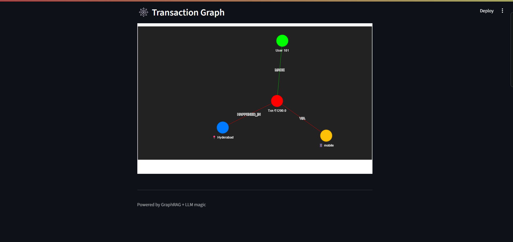

# 🔍 AI-Powered Anomaly Detection Using ClickHouse & Neo4j

[](https://anomalydetection-4ftcgcoyodgrnqclgh5pjb.streamlit.app/)

A professional, production-ready anomaly detection system leveraging ClickHouse (for fast analytics), Neo4j (for relationship-aware reasoning), and AI models for intelligent anomaly explanations. All analytics and anomaly logic are robustly handled in Python using pandas, ensuring maximum compatibility, transparency, and performance.

## 🎯 Project Overview

This project implements a state-of-the-art anomaly detection system for financial transactions, combining:
- **ClickHouse** for high-speed analytics
- **Neo4j** for graph-based relationship reasoning
- **Streamlit** for a modern, interactive dashboard
- **Pandas** for all anomaly detection logic and analytics
- **Plotly** for beautiful, interactive data visualizations
- **AI/LLM** for intelligent, context-aware anomaly explanations

> **Note:**
> All anomaly detection logic is implemented in Python using pandas, not SQL UDFs or complex subqueries. This ensures full compatibility with ClickHouse and avoids SQL scoping issues. The dashboard is visually polished and ready for demo, deployment, or portfolio use.

## 🚀 Live Demo

👉 [Click here to try the app on Streamlit Cloud!](https://anomalydetection-4ftcgcoyodgrnqclgh5pjb.streamlit.app/)

## ✨ Features

### 🔍 Anomaly Detection
- **Robust Python Logic**: All anomaly flags (large, outlier, frequency, geo, time, channel) computed in pandas
- **Composite Scoring**: Multi-dimensional anomaly scoring system
- **No SQL UDFs Needed**: Maximum compatibility and transparency

### 🤖 AI-Powered Insights
- **Dual LLM Support**: Mistral (local) + Gemini Pro (cloud)
- **GraphRAG Reasoning**: Relationship-aware anomaly analysis
- **Context-Aware Explanations**: Historical pattern comparison

### 📊 Interactive Dashboard
- **Streamlit UI**: Modern, multi-page interface
- **Plotly Visualizations**: Interactive, zoomable histograms and charts
- **Real-time Analytics**: Live anomaly detection metrics
- **User Analytics**: Individual user behavior analysis
- **System Statistics**: Overall performance insights
- **Graph Visualization**: Interactive transaction relationships

### 🏗️ Technical Architecture
- **Multi-Database**: ClickHouse (analytics) + Neo4j (relationships)
- **Scalable Design**: Cloud-ready deployment architecture
- **Performance Optimized**: Sub-second query performance
- **Real-time Processing**: Live anomaly detection pipeline

## 🖼️ Screenshots

Below are sample screenshots of the dashboard and its features:

### 1. Transaction Anomaly Explainer (Main Page)

*Select a transaction, choose an AI model, and get an instant explanation for anomalies.*

### 2. AI Explanation Section

*AI-generated, context-aware explanation for the selected transaction, including user history, amount, location, and frequency analysis.*

### 3. Transaction Graph Visualization

*Interactive graph showing the relationship between user, transaction, location, and channel.*

## 🛠️ Tech Stack

### Backend
- **Python 3.8+**: Core application logic
- **ClickHouse**: Fast analytics database
- **Neo4j**: Graph database for relationship analysis
- **Streamlit**: Interactive web dashboard
- **Pandas**: Data manipulation and anomaly logic
- **Plotly**: Interactive, modern data visualizations
- **Pyvis**: Graph visualization library

### AI/ML
- **Mistral (Ollama)**: Local LLM
- **Gemini Pro**: Cloud-based AI model
- **GraphRAG**: Relationship-aware reasoning

### Data Processing
- **Pandas**: Data manipulation and analysis
- **NumPy**: Numerical computations
- **ClickHouse Connect**: Database connectivity

## 📊 Data Schema & Anomaly Logic

### ClickHouse Table Structure
```sql
CREATE TABLE transactions (
    transaction_id String,
    user_id UInt32,
    timestamp DateTime,
    amount Float32,
    location String,
    transaction_type String,
    channel String
) ENGINE = MergeTree()
ORDER BY timestamp
```

### Neo4j Graph Schema
```
(User)-[:MADE]->(Transaction)-[:HAPPENED_IN]->(Location)
(Transaction)-[:VIA]->(Channel)
```

### Anomaly Detection Logic (in Python/pandas)
- **Large Transaction**: `amount > 50000`
- **Statistical Outlier**: More than 3 std deviations from user mean
- **Frequency Anomaly**: >10 transactions in 1 hour for a user
- **Geographic Anomaly**: New location for a user
- **Time-based Anomaly**: Transaction between 2-5 AM
- **Channel Anomaly**: New channel for a user
- **Composite Score**: Weighted sum of all flags

## 🚀 Quick Start & Setup

### Prerequisites
- Python 3.8+
- ClickHouse Server
- Neo4j Database
- Ollama (for local Mistral)
- Google Cloud API Key (for Gemini)

### Installation & Setup

1. **Clone the repository**
   ```bash
   git clone https://github.com/prabhaspaddana/anomaly-detection.git
   cd anomaly-detection
   ```

2. **Set up virtual environment**
   ```bash
   python -m venv venv
   source venv/bin/activate  # On Windows: venv\Scripts\activate
   pip install -r backend/requirements.txt
   ```

3. **Configure environment variables**
   Create a `.env` file:
   ```env
   NEO4J_URI=bolt://localhost:7687
   NEO4J_USER=neo4j
   NEO4J_PASSWORD=test1234
   GEMINI_API_KEY=your_gemini_api_key
   ```

4. **Start databases**
   ```bash
   # Start ClickHouse
   clickhouse-server --config-file=clickhouse_config/users.xml
   
   # Start Neo4j
   neo4j start
   
   # Start Ollama (for local Mistral)
   ollama serve
   ollama pull mistral
   ```

5. **Load data**
   ```bash
   # Load data into ClickHouse
   python backend/clickhouse_ingest.py
   
   # Load data into Neo4j
   python backend/neo4j_ingest.py
   ```

6. **Run application**
   ```bash
   streamlit run app.py
   ```

7. **Access dashboard**
   Open `http://localhost:8501` in your browser

## 📁 Project Structure

```
anomalydetection/
├── app.py                          # Main Streamlit application
├── backend/
│   ├── clickhouse_ingest.py        # ClickHouse data ingestion
│   ├── neo4j_ingest.py            # Neo4j graph construction
│   ├── graph_visualizer.py        # Graph visualization logic
│   ├── graphrag_reasoner.py       # AI/LLM-based reasoning
│   └── requirements.txt           # Backend dependencies
├── data/
│   └── transactions_50k.csv       # Sample transaction data
├── lib/                           # Frontend JS/CSS libraries
├── screenshots/                   # Dashboard screenshots
├── README.md                      # Project documentation
```

## 🧑‍💻 Usage

- **Transaction Analysis**: Select a transaction, choose an AI model, and get an instant anomaly explanation.
- **Anomaly Detection**: View real-time anomaly metrics, breakdowns, and top anomalous users.
- **User Analytics**: Analyze individual user behavior and anomaly patterns.
- **System Statistics**: Explore overall data and system performance, with interactive Plotly histograms.

## 🧪 Testing

- All anomaly detection logic is tested via the Streamlit dashboard and backend scripts.
- Neo4j and ClickHouse connections are validated at runtime.
- No separate test scripts for UDFs or Neo4j connection are needed; all logic is integrated and tested in the main app.

## 🤝 Contributing

Contributions are welcome! Please open issues or submit pull requests for improvements, bug fixes, or new features.

## 📄 License

This project is licensed under the MIT License. See [LICENSE](LICENSE) for details.

## 📬 Contact

For questions, support, or collaboration:
- **GitHub**: [prabhaspaddana](https://github.com/prabhaspaddana)
- **Email**: prabhaspaddana@gmail.com

---

_Professional, production-ready, and extensible anomaly detection with ClickHouse, Neo4j, pandas, Plotly, and AI. Ready for demo, deployment, or portfolio use._ 